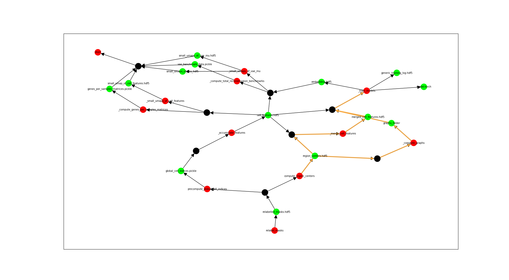

# snakemake_workaround

Quick workaround for this bug/feature request: https://github.com/snakemake/snakemake/issues/660
Use at your own risk.

## Installation

```batch

    $ python setup.py install
```

## Usage
The tool outputs a shell command which removes a list of file.
The command is
```
python -m snakemake_workaround rm-command --rule <my rule> --node0 <src node> --node1 <des node> --plot <True/False>
```
where:
- `<my rule>` is a rule which builds a dag in your Snakemake pipeline, like the rule you want to execute
- each of `<src node>` and `<des node>` can either be a full-path, refering to one of the input/output of your pipeline, either a rule
    - if one `<src node>` is specified, the list of files in output is made of all the files that are "downstream" the node
    - if both `<src node>` and `<des node>` are specified, the list of files in output is made of all the files that are "between" the two nodes.
- the boolean flag for plotting shows what is going on, by highlighting the list of files given as output

Example command:
    `rm-command --rule short --node0 compute_region_centers --node1 _train_models --plot True`

Red nodes are rules, green nodes are files, black nodes aggregates list of inputs for the same rule, and make visualization a bit easier.


Example output:
```
for f in /data/l989o/spatial_uzh/data/spatial_uzh_processed/region_centers.hdf5 /data/l989o/spatial_uzh/data/spatial_uzh_processed/phyper_data/graphs/0f867a8979f43b5b384434989df1a8b6929fce8cd78d95f6ff1d184d844d7983/graphs_folder/ /data/l989o/spatial_uzh/data/spatial_uzh_processed/phyper_data/accumulated_features/4522b0aa174e0f8c8a5890fc31da5feb032d2c3163211aba373e995273629f6d/merged_cell_features.hdf5; do rm $f; done
```


## Credits

This package was created with Cookiecutter and the `oldani/cookiecutter-simple-pypackage` project template.

- [Cookiecutter](https://github.com/audreyr/cookiecutter)
- [oldani/cookiecutter-simple-pypackage](https://github.com/oldani/cookiecutter-simple-pypackage)
